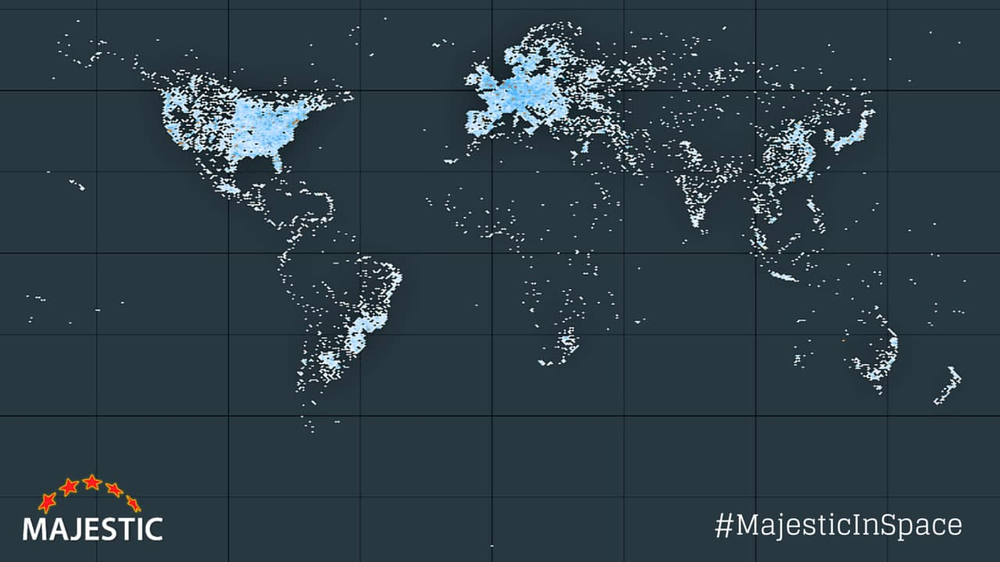

# Héritage

## Impact mondial

L'invention du World Wide Web est considérée comme l'une des plus importantes de l'histoire humaine. En quelques décennies, elle a transformé presque tous les aspects de la société :

- **Communication** : courrier électronique, réseaux sociaux, messageries instantanées
- **Commerce** : e-commerce, paiement en ligne, économie numérique mondiale
- **Éducation** : MOOCs, encyclopédies libres (Wikipédia), cours en ligne
- **Médecine** : téléconsultation, bases de données médicales mondiales
- **Science** : partage ouvert des recherches, collaboration internationale
- **Culture** : streaming musical et vidéo, bibliothèques numériques
- **Politique** : démocratie participative, journalisme citoyen

En **2024**, le Web connecte plus de **5 milliards d'utilisateurs** dans le monde.

## Distinctions

Tim Berners-Lee a reçu de nombreuses récompenses internationales pour son travail :

| Année | Distinction | Organisme |
|:-----:|:------------|:----------|
| 2004 | Chevalier de l'Empire britannique (KBE) | Couronne britannique |
| 2007 | Ordre du mérite du Royaume-Uni | Reine Elizabeth II |
| 2012 | Hommage lors des JO de Londres | Comité olympique |
| 2013 | Queen Elizabeth Prize for Engineering | Royaume-Uni |
| 2016 | **Prix Turing** — 1 million de dollars | ACM |
| 2017 | Prix du Millénaire pour la technologie | Technology Academy Finland |

Le **prix Turing** est souvent appelé le *Nobel de l'informatique*. Berners-Lee l'a reçu pour l'ensemble de son œuvre.

## Combat pour le Web libre

Malgré son statut d'inventeur du Web, Berners-Lee reste très engagé pour **défendre un Web ouvert et équitable**. Il s'oppose notamment à :

- La **surveillance de masse** par les gouvernements
- La **monopolisation** du Web par quelques entreprises (GAFAM)
- Les **inégalités d'accès** dans les pays en développement
- La **désinformation** et la manipulation algorithmique

En **2019**, il lance le **Contract for the Web**, un document signé par des gouvernements, des entreprises et des citoyens, définissant les principes d'un Web sain et éthique.

> « Le Web que j'ai imaginé, ouvert et libre, n'est pas celui d'aujourd'hui. Nous devons le réparer avant qu'il ne soit trop tard. » — Tim Berners-Lee, 2018
