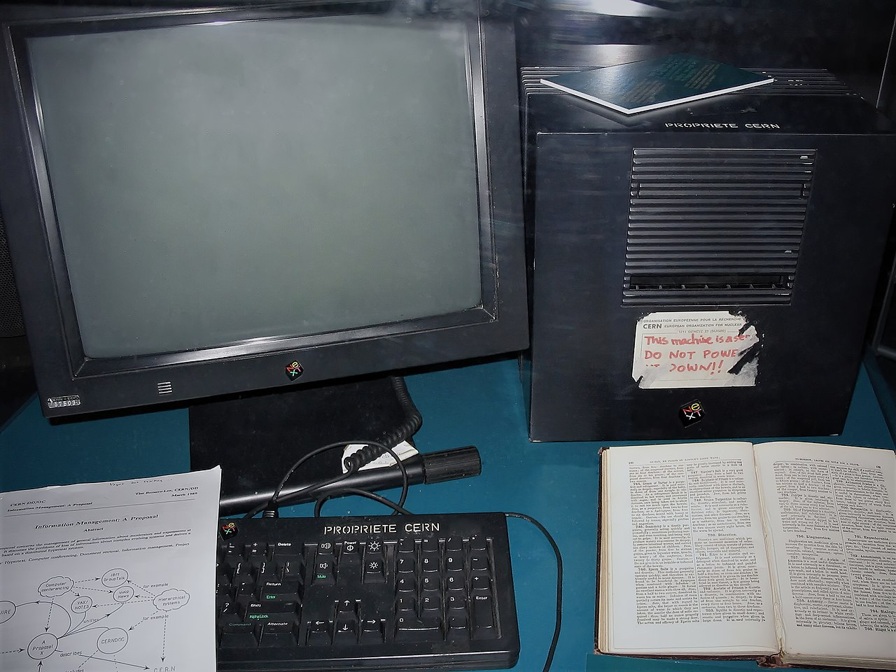

# Les Inventions de Tim Berners-Lee

## Le World Wide Web

En **1989**, Berners-Lee soumet au CERN un mémo intitulé *Information Management: A Proposal*. L'idée centrale est de relier des documents entre eux par des **liens hypertextes**, accessibles via un réseau informatique.

Le système repose sur trois piliers fondamentaux :

- Des **documents reliés par des liens** (hypertexte)
- Un **protocole de communication** entre machines (HTTP)
- Un **système d'adresses universelles** pour identifier chaque ressource (URL)

Le **6 août 1991**, il met en ligne le **premier site web de l'histoire** à l'adresse info.cern.ch. Berners-Lee ne dépose aucun brevet : il offre son invention au monde entier, gratuitement.

## HTML, HTTP et URL

Pour faire fonctionner le Web, Berners-Lee invente trois technologies fondamentales, toujours utilisées aujourd'hui :

| Technologie | Nom complet | Rôle |
|:-----------:|:------------|:-----|
| **HTML** | HyperText Markup Language | Structurer les pages web |
| **HTTP** | HyperText Transfer Protocol | Communication client-serveur |
| **URL** | Uniform Resource Locator | Adresse unique d'une ressource |

### HTML en détail

Le HTML est un langage de **balisage** qui utilise des balises pour structurer le contenu d'une page web. Voici les balises les plus courantes :

- `h1` à `h6` : titres de différents niveaux
- `p` : paragraphes de texte
- `a` : liens hypertextes
- `img` : images
- `table`, `tr`, `td` : tableaux de données
- `ul`, `ol`, `li` : listes

**À savoir :** Chaque fois que vous tapez une adresse dans votre navigateur ou cliquez sur un lien, vous utilisez directement les inventions de Tim Berners-Lee.

## Le W3C

En **1994**, Berners-Lee fonde le **World Wide Web Consortium (W3C)** au MIT. Le W3C est l'organisation internationale chargée de définir les **standards du Web**.

Ses missions principales :

- Publier les spécifications de **HTML, CSS, XML, SVG**, etc.
- Garantir la **compatibilité** entre les navigateurs et les systèmes
- Promouvoir l'**accessibilité** du Web pour tous
- Maintenir le Web **ouvert et libre** de tout brevet

## Le projet SOLID

En **2018**, face à la concentration des données personnelles entre les mains de quelques géants (Google, Facebook, Amazon), Berners-Lee lance **SOLID** (*Social Linked Data*).

L'idée : chaque utilisateur possède un **Pod** (Personal Online Datastore) où ses données lui appartiennent vraiment. Les applications accèdent aux données avec permission, mais ne les possèdent pas.

SOLID vise à **re-décentraliser** le Web, à rebours de la tendance des années 2010.
