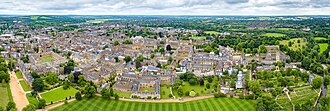

# Vie et Parcours

## Enfance

Timothy John Berners-Lee naît le **8 juin 1955** à Londres dans une famille de mathématiciens. Ses deux parents, **Conway Berners-Lee** et **Mary Lee Woods**, ont travaillé sur le **Ferranti Mark 1**, l'un des premiers ordinateurs commerciaux de l'histoire.

Tim grandit entouré de livres de mathématiques et de discussions autour des machines à calculer. Il développe très tôt une passion pour l'électronique, qu'il bricole dans sa chambre. À l'école, il se distingue par ses facilités en sciences et en logique.

## Formation

Tim Berners-Lee intègre le **Queen's College** de l'Université d'Oxford où il étudie la **physique**. Il en sort diplômé en **1976** avec mention.

Après son diplôme, il travaille dans plusieurs entreprises informatiques britanniques :

- **Plessey Telecommunications** (1976–1978) : ingénieur en télécommunications
- **D.G. Nash Ltd** (1978–1980) : développement de logiciels temps réel
- **Image Computer Systems Ltd** (1980–1984) : ingénieur principal

Ces expériences lui donnent une solide maîtrise des systèmes distribués et des réseaux.

## Au CERN

En **1980**, Berners-Lee effectue un premier séjour de six mois au **CERN** à Genève. C'est là qu'il développe **ENQUIRE**, un logiciel de gestion de l'information — l'ancêtre direct du Web.

Il revient au CERN en **1984** comme chercheur permanent. En **mars 1989**, il rédige sa proposition fondatrice intitulée *Information Management: A Proposal*. Son supérieur, Mike Sendall, note dessus : « Vague mais passionnant ».

| Étape au CERN | Date | Résultat |
|:--------------|:-----|:---------|
| 1er séjour consultant | 1980 | Développement d'ENQUIRE |
| Retour chercheur permanent | 1984 | Travail sur les systèmes distribués |
| Proposition du Web | Mars 1989 | Mémo Information Management |
| 1er serveur Web opérationnel | Décembre 1990 | Le Web existe vraiment |
