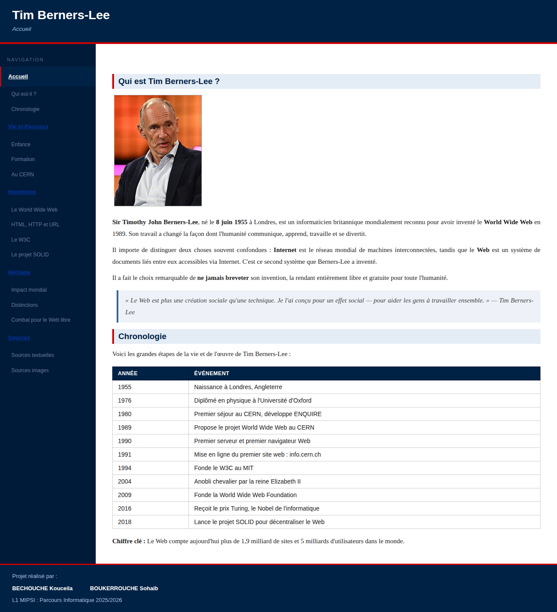
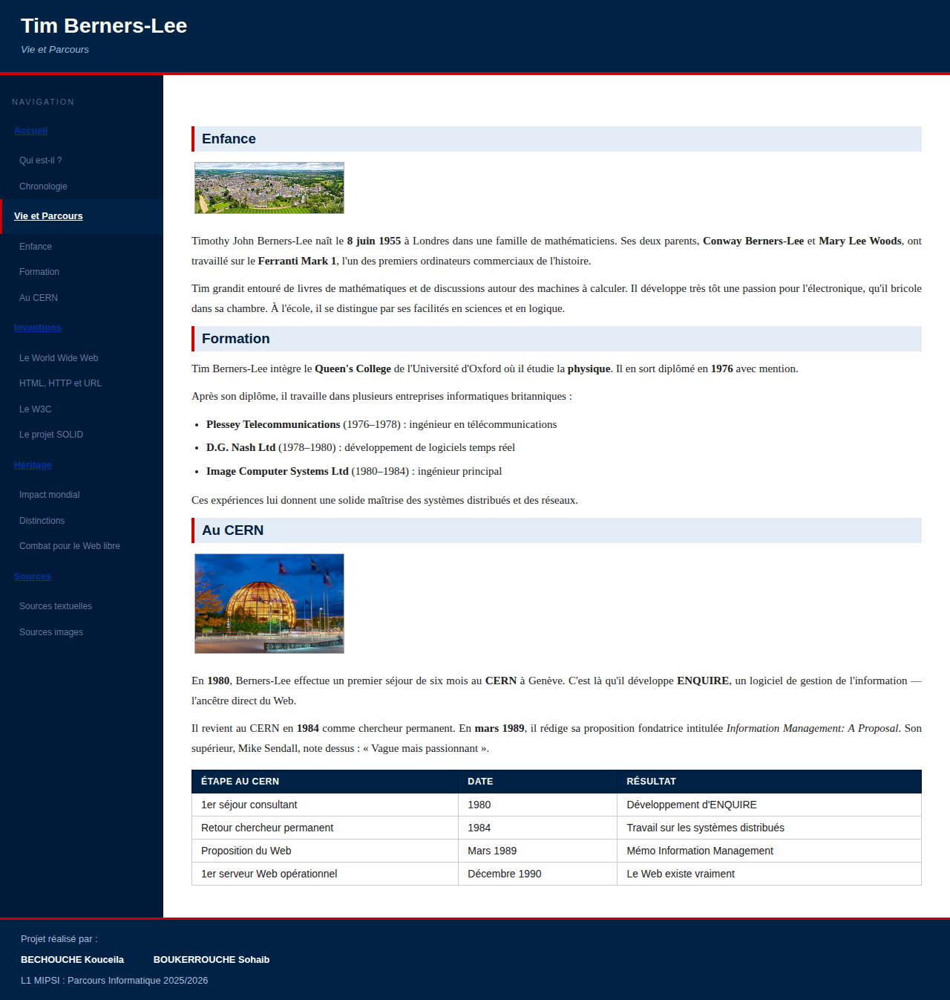
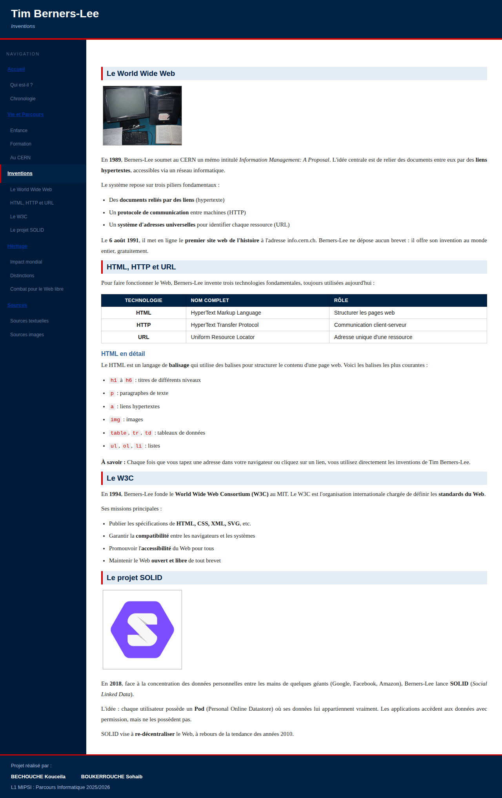
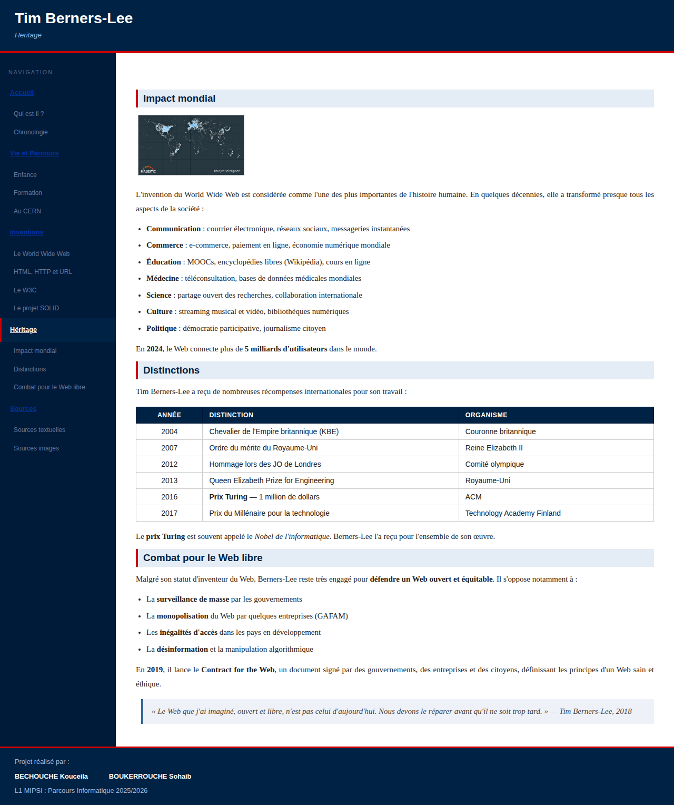
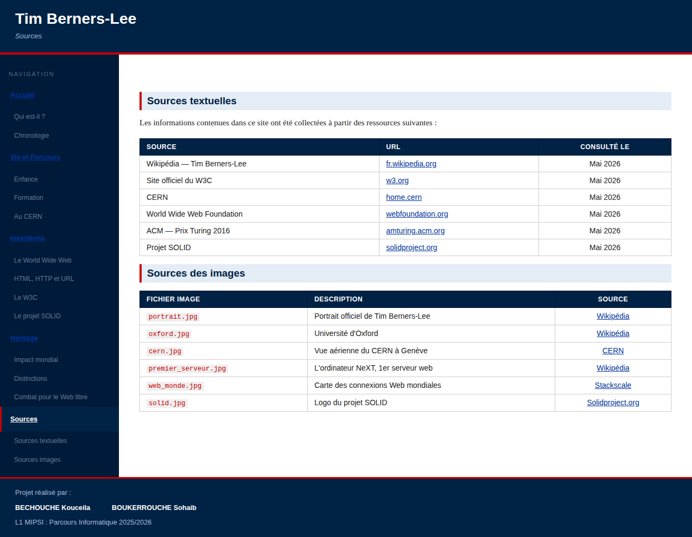

# Projet Doc Web

**Formation :** L1 MIPSI – Parcours Informatique 2025-2026 \
**Évaluation :** compte pour 1/2 de la note de contrôle continu de l'UE \
**Travail :** en binôme

## Objectif

Réaliser un **mini site web d'au moins 5 pages HTML** sur un thème imposé. Les pages ont la même structure générale et partagent la même feuille de style.

**Thème imposé :** une personnalité dont les travaux ont marqué l'histoire des sciences et techniques.

## Structure de chaque page

Chaque page est composée de 4 blocs, identifiés par ces `id` :

| Bloc | Identifiant | Rôle |
|------|-------------|------|
| Menu | `#menu` | Liens vers toutes les pages du site, et vers chaque section de chaque page |
| Titre | `#titre` | Nom du site et titre de la page |
| Contenu | `#contenu` | Informations de la page, organisées en sections avec titres |
| Auteurs | `#auteurs` | Identification des auteurs du projet |

La disposition des blocs est libre : menu en haut, à gauche ou à droite. Des modèles très simples sont fournis dans l'archive `projetInfoDoc26.zip` (sur EUREKA). Ils doivent obligatoirement être **améliorés et personnalisés**.

### Règles sur le contenu

- Le contenu est organisé en **sections introduites par des titres**.
- Ces sections sont accessibles par des **liens internes** sur les titres.
- Le menu propose, pour chaque page, des liens directs vers chaque section.

## Pages du site

- une page d'accueil : `index.html`
- **au moins 3 pages de contenu**
- **1 page de sources** qui recense toutes les sources d'information utilisées

Cela fait 5 pages minimum. Il n'est pas nécessaire de rédiger soi-même le contenu, mais **toutes les sources doivent être citées**.

## Architecture des fichiers

Noms de dossiers et de fichiers **sans espace et sans caractères accentués**.

```
ProjetDocWeb/
├── MarkDown/
│   ├── index.md
│   ├── fichier1.md
│   └── ...
├── HTML/
│   ├── index.html
│   ├── fichier1.html
│   └── ...
├── Images/
│   ├── image1.jpg
│   └── ...
└── CSS/
    └── nomEtudiant.css
```

## Consignes à respecter : 

### Code Pandoc
- Le template et les sous-templates de la structure de page utilisés dans le site.

### Code Markdown
- Les prototypes des pages en Markdown.
- Un **fichier `.txt`** listant les **commandes pandoc** utilisées pour générer les fichiers HTML (et éventuellement les sous-templates).

### Code HTML final
- Produit avec pandoc.
- **Valide en XHTML 1.0 Strict.**
- Doit obligatoirement contenir :
  - des **images** ;
  - un ou plusieurs **tableaux de données** ;
  - des **listes**.

### Code CSS
Le CSS doit utiliser :

- des **sélecteurs de type** ;
- des **sélecteurs de classe** ;
- des **sélecteurs d'identifiant** ;
- des **sélecteurs contextuels**.

Il doit utiliser les propriétés de :

- **polices** ;
- **texte** ;
- **listes** ;
- **tableaux** ;
- **boîtes**.

## Aperçu






